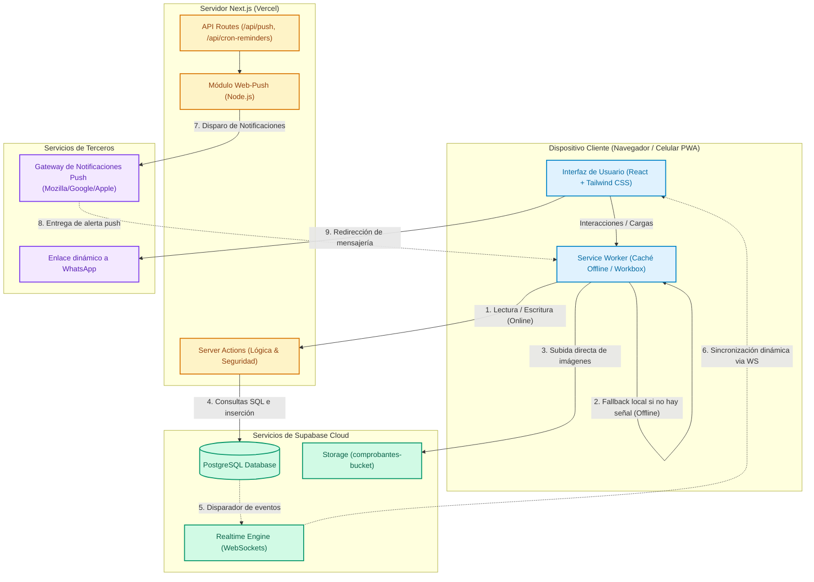
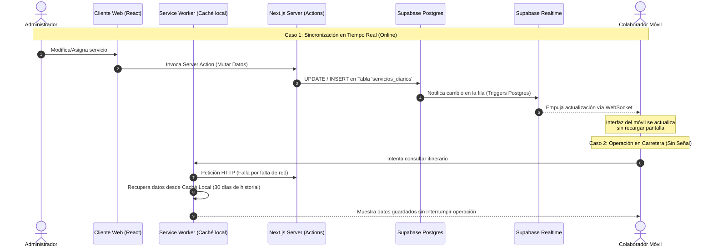

# Arquitectura General del Sistema

Este documento describe la arquitectura general de **TourFlow** y la comunicación entre sus componentes de frontend, backend y servicios de base de datos distribuidos en la nube.

---

## 1. Diagrama de Arquitectura General

El siguiente diagrama muestra los componentes principales del sistema y cómo se comunican entre sí durante la operación ordinaria:

---

## 2. Diagrama de Flujo: Realtime y Soporte Offline

El siguiente flujo detalla el comportamiento del sistema cuando el administrador registra un cambio y cómo se refleja de inmediato en los clientes o se gestiona la pérdida de conectividad:

---

## 3. Descripción de los Componentes

### A. Capa de Presentación (Frontend / PWA)

- **Next.js (App Router):** Estructura y renderiza las vistas. El panel administrativo del organizador se sirve de forma dinámica, mientras que las vistas táctiles móviles para colaboradores están optimizadas para un acceso móvil directo.
- **Service Worker (`next-pwa`):** intercepta las solicitudes de red. Si el dispositivo tiene internet, consulta las Server Actions; si está desconectado, recupera de inmediato la última instantánea guardada en la caché local del navegador (con vigencia de hasta 30 días para datos de Supabase).

### B. Capa de Servidor (Backend Next.js)

- **Server Actions:** Canal seguro para realizar peticiones a Supabase usando variables de entorno que nunca se exponen al cliente. Valida la sesión y el código de acceso antes de procesar las operaciones.
- **Rutas de API (`api/`):** Expone endpoints específicos para tareas del sistema, como el servicio de notificaciones y la activación periódica de recordatorios (`cron-reminders`).

### C. Capa de Datos e Infraestructura (Supabase Cloud)

- **PostgreSQL:** Almacén persistente de datos relacionales con llaves foráneas e índices estructurados.
- **Realtime Engine:** Servicio que escucha el log de transacciones (`Write-Ahead Log`) de PostgreSQL y transmite inmediatamente cualquier inserción o actualización mediante canales WebSocket (`supabase_realtime`) a los navegadores web suscritos.
- **Storage Bucket (`comprobantes-bucket`):** Contenedor de objetos estáticos para las imágenes y fotografías de depósitos o transferencias bancarias de los servicios que se cargan desde dispositivos móviles.
