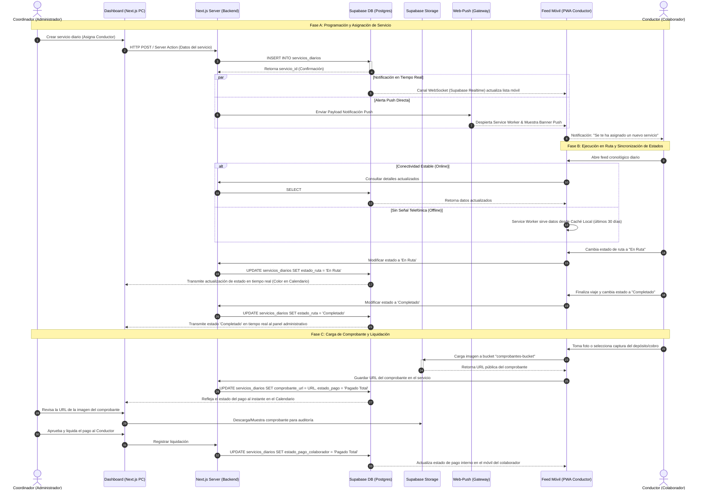

# Diagrama de Secuencia: Ciclo de Vida del Servicio Turístico

Este documento detalla la interacción cronológica y el flujo de mensajes entre los distintos componentes del sistema TourFlow durante las diferentes fases del ciclo de vida de un servicio logístico.

---

## 1. Diagrama de Secuencia General

El siguiente diagrama detalla la creación de un traslado, la notificación automática del conductor, el funcionamiento offline/online de actualización de estados y el cierre financiero con el comprobante de pago:

---

## 2. Explicación de las Fases del Diagrama

### Fase A: Programación y Asignación

1.  **Inserción de Datos:** El administrador utiliza el formulario en su pantalla de escritorio (Dashboard) para registrar un nuevo tour. La aplicación Next.js ejecuta un Server Action que interactúa de manera directa con Supabase.
2.  **Sincronización Silenciosa:** Al insertarse el registro en Postgres, el motor de tiempo real de Supabase (`Realtime`) publica el evento en el WebSocket que escucha el dispositivo móvil del conductor. Esto redibuja el listado de servicios móviles de forma imperceptible.
3.  **Notificación Física (Push):** Dado que el navegador del conductor puede estar cerrado o en segundo plano, el backend de Next.js utiliza el estándar de notificaciones Push web (`web-push`). La alerta viaja por los servidores de empuje del navegador (como FCM en Chrome de Android) e instruye al Service Worker para mostrar un banner interactivo al usuario.

### Fase B: Ejecución en Ruta (Online/Offline)

1.  **Lectura Resiliente:** Cuando el conductor está en tránsito y la señal telefónica se interrumpe, el Service Worker interviene. En lugar de arrojar una pantalla de error, la PWA carga la versión almacenada localmente en la caché de datos.
2.  **Actualización de Avances:** A medida que el conductor marca que inició el recorrido (`En Ruta`) o que ha concluido la logística (`Completado`), el sistema envía actualizaciones. Si hay red, estas peticiones viajan al servidor actualizando el calendario del administrador al instante (quien ve cambiar la insignia del servicio a verde, amarillo o rojo en tiempo real).

### Fase C: Comprobante y Liquidación Financiera

1.  **Subida de Archivos:** Para finalizar la operación diaria, el conductor puede capturar una foto del ticket de depósito o la transferencia de dinero. El archivo se sube de forma asíncrona directamente a la nube mediante Supabase Storage.
2.  **Enlace Técnico:** La PWA asocia la URL devuelta por el Storage al registro de base de datos del servicio diario. El administrador visualiza inmediatamente un enlace a la foto en su calendario macro de escritorio.
3.  **Cierre de Cuentas:** Una vez auditado el comprobante, el administrador liquida los honorarios del colaborador, marcando el servicio como cerrado. Esta última modificación actualiza de igual forma la vista del conductor indicándole que su cobro ha sido pagado en su totalidad.
